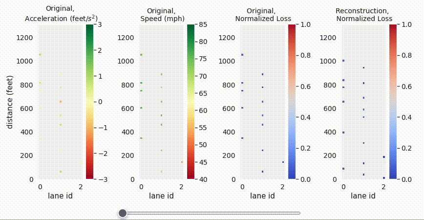
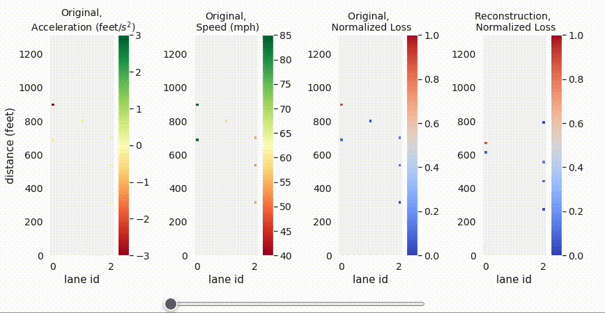

# DSAB-Detecting Socially Abnormal Highway Driving Behaviors via Recurrent Graph Attention Networks

## Yue Hu, Yuhang Zhang, Yanbing Wang, Dan Work

This work focuses on detecting abnormal driving behaviors from trajectories produced by highway video surveillance systems. We consider the problem of detecting a variety of socially abnormal driving behaviors, i.e., behaviors that do not conform to the behavior of other nearby drivers. To solve this problem, we propose an autoencoder with a Recurrent Graph Attention Network that can capture the highway driving behaviors contextualized on the surrounding cars, and detect anomalies that deviate from learned patterns. Our model is scalable to large freeways with thousands of cars. 


## Model

We construct a spatial-temporal dynamic graph to represent vehicles on a highway. Then we use an encoder to compress the dynamic graph into a low-dimensional encode vector, and a decoder to reconstruct the input vehicle states. The encoder and decoder is based on Recurrent Graph Attention Network (RGAT), which is a combination of REcurrent Neural Network (RNN) with Graph Attention Network (GAT). In the encoder, $X_t$ , $\mathcal{E}_t$ denotes the node feature matrix and edge set respectively. In the decoder, $\hat{X}_t$ is the node reconstruction matrix, $\mathcal{E}$ is the union of all input edge sets. The edge set only limits the range of neighbors each node attends to, while the importance of neighbors is calculated dynamically with an attention mechanism.

<div align='center'>
</img>
</div>
<br />

## Example videos

A snapshot of normal vehicle trajectories in real-world HighD dataset capturing German highways. Each dot represents a car, and the line indicates its past trajectory. The first column shows the acceleration of the original input trajectory. Most times it is very pale, in this range around 0. When it becomes very visible, there is drastic acceleration/deceleration. The second column shows the speed. The third column shows the normalized reconstruction loss, which is also the anomaly score. All the vehicles has loss around 0 and are normal samples. The fourth column shows the reconstruction trajectory with largest probability, and it reconstructs the original inputs quite well.

<div align='center'>
</img>
</div>
<br />


A snapshot of the largest anomaly in the HighD test set. In the third column, the red car with loss around 1 is the anomaly. The first plot shows that it is changing lane while having large deceleration, forcing the other car to change lane as well.

<div align='center'>
</img>
</div>
<br />


## Setup

The code was written in Python 3.8.12. The main packages required are
pandas                        1.4.1;
torch                         1.11.0;
torch-cluster                 1.6.0;
torch-geometric               2.0.4;
torch-scatter                 2.0.9;
torch-sparse                  0.6.13;
torch-spline-conv             1.2.1;
torchvision                   0.12.0;
scikit-learn                  1.1.1;

The complete list of packages are in the `requirements.txt`

## Using the code

Change working directory to `code\`

First generate the training/testing data in graph format from the .csv trajectory tables by running 


```bash
sh scripts/preprocessing.sh
```

To use the pretrained model and evaluate the performance, run

```bash
sh scripts/test_trained_model.sh
```

To train the model and test its performance, run 

```bash
sh scripts/train_and_test.sh
```
